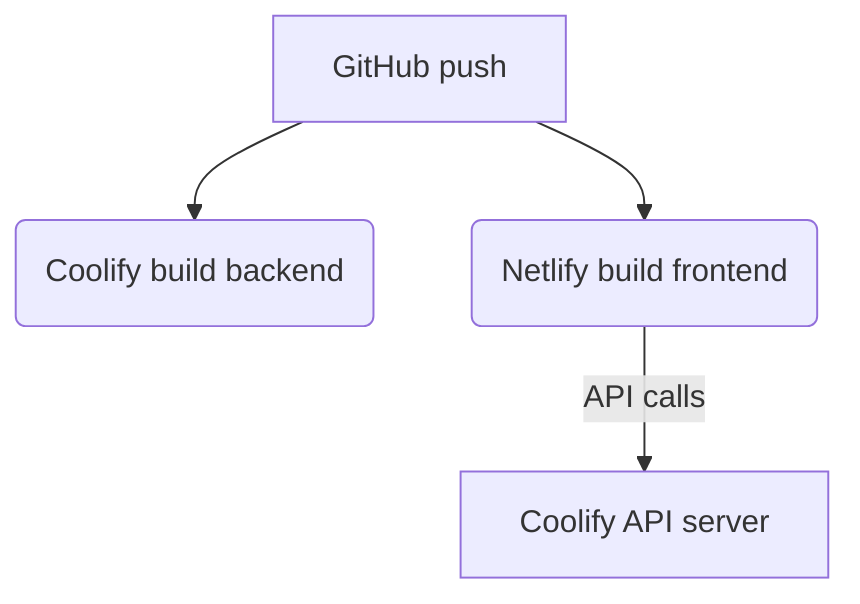

# Deploy backend con Coolify e frontend con Netlify

## ✨ Panoramica

È possibile usare **Coolify** come PaaS self-hosted per il backend (es. API) e **Netlify** per il frontend statico. In Coolify si crea una “resource” collegata al repo GitHub del backend, configurando build e rete. Netlify ospita invece il sito statico/SPA del frontend, collegato a GitHub separatamente. In produzione il frontend può puntare al backend via URL (configurando CORS, SSL, ecc.).

## 🔧 Configurazione Coolify (Backend)

### 1. Connessione a GitHub
- Crea un nuovo *Project* su Coolify
- Aggiungi una *Resource* collegata al repo GitHub
- Seleziona:
  - branch (es. `main`)
  - build pack: `Dockerfile`, `Nixpacks`, `Compose`
  - base directory: `/backend` (se è in monorepo)

### 2. Build & Avvio
- Se usi Dockerfile:
  - assicurati che l'app ascolti su `0.0.0.0`
  - porta: es. `EXPOSE 4880`
- Non esporre manualmente le porte nel `docker-compose.yml` (Coolify usa Traefik)
- Coolify gestisce il reverse proxy automatico

### 3. Environment & Rete
- Imposta le variabili d'ambiente via UI
- Usa un dominio reale (es. `api.miosito.com`)
- Coolify genera certificato HTTPS (Let's Encrypt)

## 📈 Configurazione Netlify (Frontend)

- Collega il repo GitHub (es. monorepo o dedicato)
- Base directory: `/frontend`
- Configura file `netlify.toml` se necessario
- Fornisce dominio automatico (es. `miosito.netlify.app`)
- Facile deploy continuo da GitHub

## 💡 Comunicazione Frontend → Backend

### 1. CORS
- Backend deve accettare richieste da dominio frontend (CORS)
- Header: `Access-Control-Allow-Origin`, `Access-Control-Allow-Credentials`, ecc.

### 2. Autenticazione
- Se usi cookie di sessione: `SameSite=None; Secure`
- Più semplice: usare JWT in header

### 3. URL e Domini
- Frontend su `www.miosito.com` (Netlify)
- Backend su `api.miosito.com` (Coolify)
- Configura DNS con A/ALIAS record verso il server Coolify

### 4. Proxy opzionale da Netlify
- Usa `netlify.toml` per fare rewrite `/api/*` verso backend se vuoi nascondere CORS

## 🔓 Sicurezza e Produzione

- Usa ambienti separati (staging/prod)
- Verifica i certificati SSL validi
- Configura backup DB se usi Coolify per database
- Usa `rollback` se qualcosa va storto
- Controlla uso RAM/CPU se server condiviso

## 🔗 Risorse utili

- [Coolify Docs](https://coolify.io/docs)
- [Coolify GitHub Deploy](https://coolify.io/docs/deployment/git)
- [Netlify Rewrites e Proxy](https://docs.netlify.com/routing/redirects/)
- [Configurare CORS](https://developer.mozilla.org/en-US/docs/Web/HTTP/CORS)

## 🔄 Workflow Tipico

## 🚀 Conclusione
Con questa architettura puoi gestire frontend e backend in modo separato ma armonico:
- Coolify = potente, self-hosted, backend-ready
- Netlify = velocissimo per frontend statici

Configurazione flessibile, scalabile, e tutta tua.

